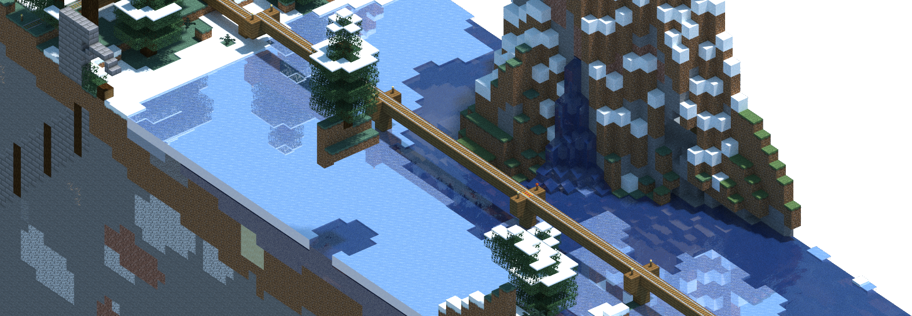

# chunky-fargate



Dockerized image + pipeline for the [Chunky](https://chunky.llbit.se/) Minecraft
render on AWS Fargate, with S3 as an input and output store.

* [Setup](#setup)
* [Run locally](#run-locally)
* [Run in Docker](#run-in-docker)
* [Set up infrastructure](#set-up-infrastructure)
* [Run a remote render task](#run-a-remote-render-task)
* [Render scenes in parallel](#render-scenes-in-parallel)
* [Run a task on zip upload](#run-a-task-on-zip-upload)

### TODO

- Notification when a render task completes.


## Setup

1. Download `ChunkyLauncher.jar` from the
[Chunky website](https://chunky.llbit.se/).

2. Set up at least one scene in the Chunky GUI, then copy the scene's directory
   to this project in a local `./scenes` directory
   (at least the JSON file included).


## Run locally

Install some dependencies (Java + JavaFX):

```shell
sudo apt-get install default-jdk libopenjfx-java libcontrolsfx-java jq
```

Copy a scene to a local `./scenes` directory, then render the scene to a target
SPP:

```shell
./pipeline/render-scene.sh $worldDir $sceneName $targetSpp
```

> Optionally, restart the render from 0 SPP, and update the world files by
> adding the `--restart` option.

The output PNG snapshot will be saved by Chunky in the scene directory.


## Run in Docker

The Docker image is used to fetch a world and scene from S3, render the scene,
and upload the output PNG snapshot to the same S3 bucket.

First, build the Docker image:

```shell
docker build -t chunky-fargate .
```

Next, select an S3 bucket and create a top-level `chunky-fargate` directory,
where all concerned world, scene, and output render files will be located.

Upload the scene JSON file to the S3 bucket in a `scenes` subdirectory. The
scenes in the bucket must point to the worlds present in the `worlds`
subdirectory. For example:

```
s3://$BUCKET/
  - chunky-fargate/
    - worlds/
      - village-world.zip
    - scenes/
      - village-church-interior.json
```

Then run the Docker image, supplying all the required parameters as environment
variables. This will pull the world `$WORLD_NAME`, and fetch and render
the scene `$SCENE_NAME`, using the AWS credentials specified, and finally push
the output render PNG snapshot to `$BUCKET/chunky-fargate/renders/$DATE`:

```shell
docker run \
  -e WORLD_NAME \
  -e SCENE_NAME \
  -e TARGET_SPP \
  -e BUCKET \
  -e AWS_DEFAULT_REGION \
  -e AWS_ACCESS_KEY_ID \
  -e AWS_SECRET_ACCESS_KEY \
  chunky-fargate
```


## Set up infrastructure

The Docker container can also be used to run a render job remotely on AWS
Fargate, a serverless compute platform.

> If you haven't, choose or create an S3 bucket for the project to use, and
> create a top-level `chunky-fargate` directory, where all concerned world,
> scene, and output render files will be located.

First, set your own pre-existing S3 bucket name in the `terraform/main.tf` file
for your Terraform state files.

Then, create the basic infrastructure resources required (ECR, ECS, IAM, etc.)
by running Terraform:

```shell
# AWS credentials to use
export AWS_DEFAULT_REGION=us-east-1
export AWS_ACCESS_KEY_ID=...
export AWS_SECRET_ACCESS_KEY=...

# S3 bucket to use (same as $BUCKET above)
export BUCKET=...

./pipeline/deploy-infra.sh
```

Build the Docker image:

```shell
docker build -t chunky-fargate .
```

Push the most recently built image to ECR:

> The first push with the dependency layer will take a while, but subsequent
> updates to the image should not.

```shell
./pipeline/push-image.sh
```

If you haven't already, add a statement to the Bucket Policy of the output
S3 bucket allowing the Task Role access, similar to the following:

```json
{
  "Sid": "Stmt1610292864520",
  "Effect": "Allow",
  "Principal": {
    "AWS": "arn:aws:iam::$ACCOUNT_ID:role/chunky-fargate-task-role"
  },
  "Action": [
    "s3:GetObject",
    "s3:PutObject",
    "s3:ListBucket"
  ],
  "Resource": [
    "arn:aws:s3:::$BUCKET/*",
    "arn:aws:s3:::$BUCKET"
  ]
}
```


## Run a remote render task

Now the fun part!

Run a Fargate task to perform the render of the chosen world and scene:

```shell
# Create the Fargate task
./pipeline/run-fargate.sh
```

You will be asked for the following which may change for each render task:

* World name - Name of the world files zip file.
* Scene name - Name of scene in `scenes` to render.
* Target SPP - Target samples per pixel.
* S3 bucket - Bucket where worlds and scenes are, and output PNG can be saved.

For example:

```
$ ./pipeline/run-fargate.sh

World name: render-test-world
Scene name: render-test-scene
Target SPP: 100
S3 bucket: s3://public-files.chrislewis.me.uk

Fetching required resources...
Creating task...
Started: arn:aws:ecs:us-east-1:$ACCOUNT_ID:task/chunky-fargate-ecs-cluster/$TASK_ID
```

The output PNG will be available in `$BUCKET` as per a normal Docker run.

If you add or change a scene, don't forget to update the scene JSON file in S3.


## Render scenes in parallel

Define a set of one or more scenes to be rendered in parallel as separate
Fargate tasks within a single world using a JSON file configuration as the
following format example:

```json
{
  "bucket": "public-files.chrislewis.me.uk",
  "world": "render-test-world",
  "scenes": [
    {
      "name": "render-test-scene",
      "targetSpp": 150
    }
  ]
}
```

Place the JSON file in a `tasks` directory in the S3 bucket:

```
s3://$BUCKET/
  - chunky-fargate/
    - tasks/
      - render-test.json
```

Then, launch all scenes as tasks, specifying the JSON file's name. For example:

```shell
./pipeline/run-task-file.sh render-test.json
```

As usual, once each task completes all the output PNG files will be found in S3.


## Run a task on world upload

Once you have scenes uploaded, you can enable an S3 notification that runs a
Lambda function capable of automatically starting render jobs for that world.

When a new zip file is uploaded to the `worlds/` directory in the bucket, the
Lambda function will find the first task in `tasks/` directory that has the
world name in _its_ name.

For example, if a world zip called `render-test-world.zip` is uploaded to the
specified S3 bucket, the task file called `render-test-world-landscapes.json`
would be chosen and the scenes in it rendered using Fargate tasks. That task
file must specify the same world name as the zip file uploaded. For example,
the task shown above in _Render scenes in parallel_.

To enable this feature, set `UPLOAD_TRIGGER_ENABLED` when re-deploying the
infrastructure:

```shell
# Enable the upload trigger
export UPLOAD_TRIGGER_ENABLED=true

./pipeline/deploy-infra.sh
```
